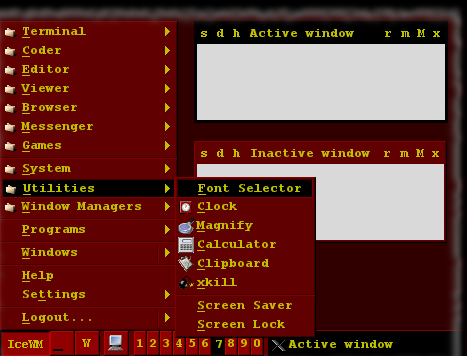

# Mars Text

Actually this is a remake of the old Mars Text theme I put together when I started using [IceWM](http://www.icewm.org/).

Originally this was intended to be the predecessor of a fully graphic Mars theme, but then I liked this one so much that I gave up with the sequel.

## Screenshot

desktop fragment with Mars Text
{: .precaption .icon-screenshot}

## Usage

There is nothing special in its usage, however I found that some spectators got confused occasionally by the palette. They expected the window with the lighter title bar
to be the active one, but in Mars Text the active/selected element is always the one with black background :

palette sample
{: .precaption}

**Inactive window**{: .inactive}
**Active window**{: .active}
**Inactive window**{: .inactive}
**Minimized window**{: .minimized}
{: .sample}

## Configuration

Configuration not really supported.

All you can do is configure IceWM itself. I intended to set up everything, even for features I not use. But still there are some dark spots I not understand. ( See the
Plans section below for details. )

## Versions

* 0.0
  * {: .added} Initial release.
* 0.1 - February 2013
  * {: .added} Remake.
{: .changelog}

## Plans

* {: .pending} Find out the reason of not using the image of show desktop button and fix it.
* {: .pending} Find out where may scrollbar appear and set its colors.
* {: .pending} Find out how APM monitor looks and set its colors.
* {: .pending} Maybe draw a few application icons to match the theme.
{: .todo}

## Download


