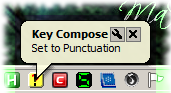
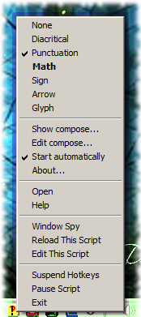
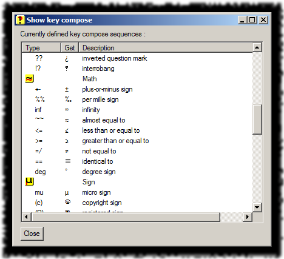

# Key Compose

All started with Alex Benenson's great extension for Firefox,
[Transliterator](https://addons.mozilla.org/en-US/firefox/addon/transliterator/).
With that writing letters with diacritical marks became fast and easy.

When I met AutoHotkey, my first question was, could I write something similar to
Transliterator, but not limited to the browser ? Well, I think yes.

## Screenshot

## Usage

Once started, KeyCompose just sits in the system tray and waits. Then when you
type a key sequence for which a replacement was set, it does its job.

There can be more modes defined and you can change between them :

| Action                                                        | Change        |
|---------------------------------------------------------------|---------------|
| <kbd>Alt</kbd>-<kbd>Ctrl</kbd>-<kbd>F2</kbd>                  | next mode     |
| <kbd>Alt</kbd>-<kbd>Ctrl</kbd>-<kbd>Shift</kbd>-<kbd>F2</kbd> | previous mode |
| double-click on the tray icon                                 | next mode     |
| click on a mode name in the context menu                      | that mode     |

To cancel a replacement, press <kbd>Shift</kbd>-<kbd>Shift</kbd> before
finishing the triggering sequence. ( I mean, press both <kbd>Shift</kbd> keys
simultaneously. )

### Context menu

menu
{: .precaption .icon-screenshot}

In the top part of the context menu there are enumerated the currently defined
modes. ( The one with the checkmark is the active one, the one in bold is the
mode to which you can change by double-clicking the tray icon. )

The other command, below the list of modes :

* Show compose... -- displays the list of modes and hotstring definitions for each

    Show key compose
    {: .precaption .icon-screenshot}

    

* Edit compose... -- opens the KeyCompose-conf.ahk file in the associated editor
* Start automatically -- creates or deletes a shortcut to itself in the Startup menu
* About... -- displays information about itself

## Configuration

Sadly the hotstring definition in AutoHotkey accepts only barewords, no
variables. So the configuration must be an AutoHotkey script itself.

Anyway, I tried to reduce its format to the minimum, so the configuration not
requires programmer skills. Things to keep in mind :

* `;` starts a comment -- comments are ignored to the end of their line
* <code markdown="span">#If compose==_number_</code> starts a mode definition -- the following lines until the next similar `#If` will pertain to that mode
* <code markdown="span">::_sequence_::_character_</code> defines a hotstring -- each replacement in a separate line

And some explanations on the syntax elements :

* The _number_ is the order number of the mode. Not really meaningful, just keep
  the numbering continuous, starting from 0.
* The _sequence_ is the list of keys that needs to be pressed one after the
  other to trigger the replacement.
* The _character_ in this case will be the character to replace with, but
  actually can be longer string too.

file fragment - KeyCompose-conf.ahk
{: .precaption .icon-file}


; Key Compose   version 0.2   february 2013   written by Fehérke
; key compose functionality and more
; configuration file

#If compose==0 ; None

#If compose>=1 ; Diacritical
  ::a'::á ; a with acute
  ::a`::à ; a with grave
  ::a^::â ; a with circumflex
  ::a;::ä ; a with diaeresis
  ::a~::ã ; a with tilde
  ::ae::æ ; ae


The configuration file is also read by KeyCompose to display the definitions in
the Show key compose. So better do not add more complex expressions, even if you
know AutoHotkey.

With the configuration shipped with the script there are some particularities :

* The first mode has no hotstring definition, so it actually turns off the
  functionality. You may add definitions there too, if you want.
* The definitions are cumulative : when mode _n_ is active, all definitions of
  modes 0.._n_ are available. To change this to restrict each mode to its own
  definitions only, replace the `>=` operators to `==` in the `#If` directives.

## Versions

* 0.0 - February 2013
  * {: .added} Initial release.

* 0.1 - February 2013
  * {: .changed} Separated the hotstring list into 3 modes : None, Primary, Secondary.
  * {: .added} Key <kbd>Ctrl</kbd>-<kbd>F2</kbd> to change the mode.

* 0.2 - February 2013
  * {: .changed} Moved the hotstring definitions into a configuration file.
  * {: .added} New menu command _Edit compose..._.
  * {: .changed} Key <kbd>Alt</kbd>-<kbd>Ctrl</kbd>-<kbd>F2</kbd> to change the mode.
  * {: .added} Key <kbd>Alt</kbd>-<kbd>Ctrl</kbd>-<kbd>Shift</kbd>-<kbd>F2</kbd> to change the mode backward.

* 0.3 - July 2013
  * {: .added} Key <kbd>Shift</kbd>-<kbd>Shift</kbd> to cancel a compose.
{: .changelog}

## Plans

* {: .pending} A configuration editor combined with CharMap.exe would be great.
{: .todo}

## Download


