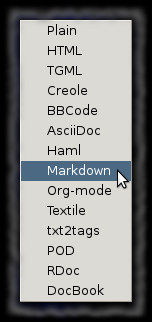

# [Popup,Hybrid] Copy URL and Title

Displays a list of formats and copies a link to the clipboard.

Currently the following formats are included :

* [AsciiDoc](http://methods.co.nz/asciidoc/)
* [BBCode](http://bbcode.org/) ( Bulletin Board Code )
* [DocBook](http://docs.oasis-open.org/docbook/)
* [#haml](http://haml-lang.com/) ( HTML Abstraction Markup Language )
* [HTML](http://w3.org/standards/techs/html) ( HyperText Markup Language )
* [Markdown](http://daringfireball.net/projects/markdown/)
* [Org-Mode](http://orgmode.org/) ( Org Emacs Mode )
* Plain text
* [POD](http://perldoc.perl.org/perlpod.html) ( Plain Old Documentation )
* [RDoc](http://rdoc.rubyforge.org/) ( Ruby Document )
* [Textile](http://textile.thresholdstate.com/)
* [TGML](http://tipmaster.com/includes/tgmlinfo.cfm) ( Tecumseh Group Markup Language )
* [txt2tags](http://txt2tags.org/)
* [WikiCreole](http://wikicreole.org/)

If the gesture was performed on an `a` element, the link will point to its `href`, otherwise to the current document.
If there is selected text, that will be the link text, otherwise the link `text` or the document `title` respectively.

## Screenshot

## Usage

Perform a gesture anywhere on a document to get a list of formats and select the one to apply before copying the link into the clipboard.

## Configuration

Configuration not really supported.

But adding new formats is pretty simple. The formats are enumerated in `FireGestures.API_copyURLTitle.format` and the filters in `FireGestures.API_copyURLTitle.filter`.

The format strings are somehow Liquid-like templates, where :

* field placeholders are enclosed in double pair of braces ( `{}` )
* field names can be followed by any number of filters separated by pipe ( `|` )
* filter parameters are separated from the filter name by colon ( `:` )

However there is no intention to completely reproduce Liquid, so filters can have at most one parameter, filter parameters are not enclosed in quotes and white spaces
inside the placeholders are not allowed. Only two fields exist : url and text. I bet you guess what they are.

## Versions

* 0.0 - April 2011
  * {: .added} Initial release.

* 0.1 - May 2011
  * {: .fixed} Excluded the `a` tags without `href` attribute from being handled as links.

* 0.2 - May 2011
  * {: .added} Added POD link format.

* 0.3 - May 2011
  * {: .added} Added RDoc link format.

* 0.4 - February 2012
  * {: .added} Added DocBook link format.
  * {: .added} Possibility to escape special characters.
{: .changelog}

## Plans

* {: .pending} Escape the special characters specific for each markup.
* {: .pending} Maybe conditional escaping for <kbd>Shift</kbd>-gesture.
{: .todo}

## Download


