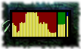

# CPU Graph

There is CPU Meter installed by default. It shows the current CPU usage level. I
never understood why such tools are written. If you look at CPU Meter a second
after the CPU-expansive process terminated, you can't find out how high the peak
was.

So I wrote this little gadget, which displays the CPU usage similar to IceWM's
tray app.

## Screenshot

CPU Graph
{: .precaption .icon-screenshot}

## Usage

Just look and enjoy.

The displayed areas :

* CPU ( red ) -- updated twice each second
* RAM ( green ) -- updated each 3 seconds
* Disk ( blue ) -- updated each 3 minutes

## Configuration

Configuration not really supported.

## Versions

* 0.0 - February 2013
  * {: .added} Initial release.

* 0.1 - March 2013
  * {: .changed} Update the areas with different frequency.
{: .changelog}

## Plans

* {: .pending} A large size view, where CPU cores and disk partitions to be
  displayed separately.
* {: .pending} Configuration to set the area sizes and update frequencies.
{: .todo}

## Download


