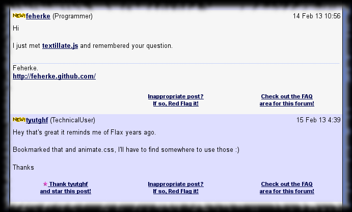
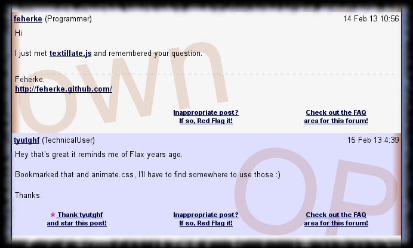

# TipMaster - Author Highlight

Improves the [TipMaster](http://tipmaster.com/)'s forums, [Tek-Tips](http://tek-tips.com/) and [Eng-Tips](http://eng-tips.com/), by adding distinctive decoration to the
OP's and own messages on the thread pages, to ease fast overview.

To have a continuous highlight on lengthy posts, I decided to apply kind of vertical decorations. To not interfere with the post content, I decided to keep decorations
on the margin. To avoid having parrot pages, I decided to use only the dark red shade which is now "traditional" in my Greasemonkey scripts.

So in the end highlighted posts get dark red vertical bar on their <del>left</del> margin as follows :

* OP's post have a dark red bar <del>_outside_</del> on the right side of the post area
* own post have a dark red bar <del>_inside_</del> on the left side of the post area

Additionally the words "OP" and "own" are added as background, aligned near the same side the dark red bar is displayed.

## Screenshot

sample rendering **without** TipMaster - Author Highlight
{: .precaption .icon-screenshot}

sample rendering **with** TipMaster - Author Highlight
{: .precaption .icon-screenshot}

## Usage

None. There is nothing interactive.

## Configuration

Configuration not really supported.

But you could improve the CSS used to highlight.

## Versions

* 0.0 - March 2012
  * {: .added} Initial release.

* 0.1 - March 2012
  * {: .changed} Changed the highlight :
    - OP posts have gradient bar on right and the word "OP" in background.
    - own posts have gradient bar on left and the word "own" in background.

* 0.2 - June 2012
  * {: .changed} Updated according to TipMaster sites' HTML changes.

* 0.3 - August 2012
  * {: .added} `@grant` metadata imperative according to Greasemonkey 1.0 API.
{: .changelog}

## Plans

* {: .pending} Think to better highlighting.
{: .todo}

## Download


