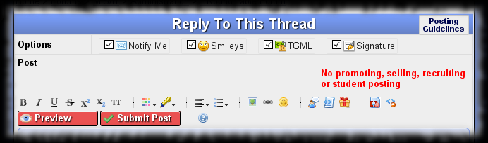
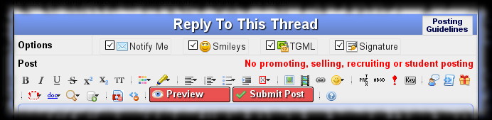

# TipMaster - markItUp! Setting

Improves the [TipMaster](http://tipmaster.com/)'s forums, [Tek-Tips](http://tek-tips.com/) and [Eng-Tips](http://eng-tips.com/), by improving the markItUp! editor's
settings used in the post forms.

The [markItUp! universal markup jQuery editor](http://markitup.jaysalvat.com/home/) is very customizable. It keeps all its setting in the global mySettings JavaScript
variable, so is enough to change that one.

Included modifications :

* Underline button's associated key <kbd>U</kbd> removed.
* Strikethrough button's associated key <kbd>S</kbd> removed.
* Superscript button associated with key <kbd>S</kbd>.
* Color drop-down list extended to the 16 HTML colors.
* Color drop-down buttons changed to insert \[red\] style tags instead of \[color red\].
* <del markdown="span">Highlight button added to insert \[highlight\] tags. ( Added to the site. )</del>
* <del>Highlight drop-down buttons added for the 6 pale colors I used to use. ( Added to the site. )</del>
* Alignment drop-down added and Left, Center and Right buttons moved into the drop-down.
* Float drop-down added with Left and Right buttons to insert \[floatl\] and \[floatr\] tags respectively.
* Box drop-down added with Inline and Block buttons to insert \[box\] and \[bbox\] tags respectively.
* Picture button changed to use the selection as default URL.
* Picture button's associated key <kbd>P</kbd> removed.
* YouTube button added to insert \[youtube\] tags.
* Link button's associated key <kbd>L</kbd> removed.
* Drop-down list added to Emoticon button to insert the smileys I used most frequently.
* Monospaced button added to insert \[tt\] tags.
* Monospaced button associated with key <kbd>M</kbd>.
* Preformatted button added to insert \[pre\] tags.
* Small button added to insert \[small\] tags.
* Attention button added to insert \[!\] tags.
* <del markdown="span">Bulleted list button modified to enclose the entire selection with \[ul\] tags and each selected line in separate \[li\] tags. ( Fixed in markItUp! 1.1.x. )</del>
* Bulleted list button associated with key <kbd>U</kbd>.
* <del markdown="span">Numeric list button modified to enclose the entire selection with \[ol\] tags and each selected line in separate \[li\] tags. ( Fixed in markItUp! 1.1.x. )</del>
* <del>Quote button modified to enclose the entire selection not each line separately. ( Fixed in markItUp! 1.1.x. )</del>
* <del>Code button modified to enclose the entire selection not each line separately. ( Fixed in markItUp! 1.1.x. )</del>
* <del markdown="span">Spoiler button added to insert \[spoiler\] tags. ( Added to the site. )</del>
* <del markdown="span">Ignore button added to insert \[ignore\] tag. ( Added to the site. )</del>
* Composite button Key added to insert key-looking \[box\] tags sequence.
* Composite button Fake TGML added with Off Topic and Flame buttons to insert TGML-looking \[fake\]..\[/fake\] text.
* Composite button Documentation added with Perl, PHP, Tcl and Tk buttons to insert links to documentations of a give term.
* Composite button TipMaster Search added with Google Search, Yahoo! Search and Lycos Search buttons to insert link to search results for a given term.
* Composite button Canned Response to store and retrieve custom text snippets.
* Drop-down list added to Unicode button to insert the characters I _think_ are used most frequently.

## Screenshot

sample rendering **without** TipMaster - markItUp! Setting
{: .precaption .icon-screenshot}

sample rendering **with** TipMaster - markItUp! Setting 0.7 (!)
{: .precaption .icon-screenshot}

## Usage

See markItUp!'s own documentation.

### Key

Transforms a space separated list of key names into a key combination markup.

Example :  
Alt Ctrl Del &#x279c; Alt-Ctrl-Del
{: .tgml-demo}

If there is selected text, uses it as input, otherwise `prompt()`s the user for key list.

### Fake TGML

Encloses a piece of text between a TGML-looking pair of text.

The toolbar button itself does nothing, the drop-down list's buttons insert the text their names say. This is kind of joke, use it sparsely.

Warning !  
Off topic and flame messages are _not_ welcome on TipMaster forums. Using these fake TGML tags or not, you post will still be subject of edition or deletion.
{: .warn}

Example :  
text &#x279c; \[off-topic\]text\[/off-topic\]
{: .tgml-demo}

If there is selected text, encloses it, otherwise uses the fake tag name as placeholder.

### Documentation

Generates a link to the documentation of a given term.

Example :  
print() &#x279c; [<tt>print()</tt>](http://perldoc.perl.org/functions/print.html){: .tgml-link}
{: .tgml-demo}

If there is selected text, uses it as input, otherwise `prompt()`s the user for documentation term.

### TipMaster Search

Generates a link to a web search for a given term.

The toolbar button itself generates link to the current TipMaster site's own search engine, the drop-down list's buttons does similar work but for the web search engines
I use most frequently.

Example :  
term &#x279c; [search Tek-Tips for "term"](http://tek-tips.com/search.cfm?q=term&amp;action=search){: .tgml-link}
{: .tgml-demo}

If there is selected text, uses it as input, otherwise `prompt()`s the user for search term.

### Canned Response

Manages a collection of predefined text snippets.

The toolbar button itself saves the current post content as canned response. The response's title is requested from the user through a `prompt()`. If a response with the
given title exists, its content is replaced with the new one, otherwise a new response is created.

The drop down buttons enumerate the available response titles. Clicking on any of them inserts the clicked one's content into the post. <kbd>Ctrl</kbd>-clicking on any
of them removes the clicked one after the user's `confirm()`. <kbd>Shift</kbd>-clicking on any of them saves over the clicked response, after user's `confirm()`.

Responses may contain \{\{text\}\} placeholders, which will be replaced with the current selection, if exists, otherwise with nothing.

The responses are stored using the Greasemonkey script's API, but that is not accessible after the script execution terminated. So adding, modifying and removing
responses can not be performed directly. The changes first are stored in the `sessionStorage` and get finalized on the next page load. So after a response manipulation
is requested, the user is `alert()`ed to reload the page. The drop-down list's content reflects the finalized manipulations.

Warning : There is a problem with marItUp!'s key detection, sometimes ( mostly on the first action after page load ) the <kbd>Ctrl</kbd> and <kbd>Shift</kbd> key's states
are detected erroneously. Watch the confirmation dialogs carefully to avoid data loss. If you accidentally prepare a modification operation you can still cancel it by
removing the corresponding `sessionStorage` entry _before_ reloading the page.

## Configuration

See markItUp!'s own documentation.

### Documentation

If you add more entries to the Documentation button's drop-down list you have to also add an entry to the `documentation` object's `url` property. The key must be
identical with button name. The value will be the URL to link to, it should contain a \{\{text\}\} placeholder, which will be replaced with the term to document.

This is expected to change radically in the future, though not guaranteed to be in the near future...

### TipMaster Search

If you add more entries to the TipMaster Search button's drop-down list you have to also add an entry to the `websearch` object's `url` property. The key must be
identical with button name, eventually without the "Search" word spaces surrounding it. The value will be the URL to link to, it should contain a \{\{text\}\}
placeholder, which will be replaced with the term to search.

## Versions

* 0.0 - May 2012
  * {: .added} Initial release.

* 0.1 - May 2012
  * {: .added} Ignore button added to insert \[ignore\] tag.
  * {: .changed} Key <kbd>U</kbd> moved from Underline button to Bulleted list button.
  * {: .changed} Picture button now uses selection as default URL instead of overwriting it.

* 0.2 - June 2012
  * {: .changed} Ignore button's icon redesigned.
  * {: .added} New composite buttons Key, Off Topic and Web Search.
  * {: .added} Key <kbd>Shift</kbd>-<kbd>Enter</kbd> assigned to Preview action.
  * {: .added} Key <kbd>S</kbd> assigned to the Superscript button.
  * {: .changed} Bullet List, Numbered List, Code, Quote and Spoiler buttons updated according to markItUp! 1.1.x.

* 0.3 - September 2012
  * {: .changed} Spoiler button's icon is now the "official" gift box icon.
  * {: .added} Emoticon button now has a drop-down list with the icons I used most frequently.

* 0.4 - October 2012
  * {: .added} Preformatted button for the new \[pre\] tag.

* 0.5 - October 2012
  * {: .changed} Ignore button's icon is now the "official" red bracket icon.
  * {: .corrected} Left, Center and Right button's icons now correctly represent the alignment type.
  * {: .changed} Preformatted button's icon redesigned.
  * {: .changed} Off Topic button renamed to Fake TGML, functionality removed.
  * {: .added} Fake TGML button now has a drop-down list with Off Topic and Flame buttons to insert the given fake markup.
  * {: .changed} Web Search button renamed to TipMaster Search, links to current TipMaster site's own search engine.
  * {: .added} TipMaster Search button now has a drop-down list Google Search, Yahoo! Search and Lycos Search buttons to various web searches.
  * {: .added} New composite button Documentation with drop-down buttons Perl, PHP, Tcl and Tk.
  * {: .added} New composite button Canned Response.

* 0.6 - October 2012
  * {: .changed} Monospace button moved near the text attribute buttons.
  * {: .changed} Highlight button's icon is now the "official" marker icon.
  * {: .added} New List button with drop-down containig Bulleted list, Numeric list and List item buttons.
  * {: .changed} Ignore button moved near the Clean button.
  * {: .changed} Key button changed to insert \[kbd\] tag instead of composite tag set.
  * {: .changed} Key button moved near the text buttons.
  * {: .added} `@grant` metadata imperative according to Greasemonkey 1.0 API.

* 0.7 - March 2013
  * {: .changed} Emoticon, Help and Submit Post buttons now call the same functions as the "official" ones.
  * {: .changed} Minor adjustment on the forbidden activities list to not wrap.

* 0.8 - April 2013
  * {: .added} New button Unicode, with the same functionality as the "official" one.
  * {: .added} Unicode button now has a drop-down list with the characters I _think_ are used most frequently.
{: .changelog}

## Plans

* {: .pending} Add more documentation links.
{: .todo}

## Download


