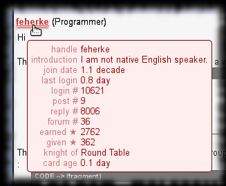

# TipMaster - Profile Card

Improves the [TipMaster](http://tipmaster.com/)'s forums, [Tek-Tips](http://tek-tips.com/) and [Eng-Tips](http://eng-tips.com/), by saving brief profile data when a
member profile is visited then displaying them all over the site when a mouse pointer is moved over the given member's profile link.

The times are displayed as fuzzy relative values. As the profiles contain only dates without time and the display is fuzzy anyway, I paid no care to timezone handling.
I do not consider this a serious issue and I have no intention to fix it. ( Excepting if I manage to get negative times. )

The script does not automatically refresh the profile card data. Although would be quite easy to implement I will not stress the server with such requests.

## Screenshot

## Usage

Move the mouse pointer over a member profile link underlined with faded dark red bar to display the member's profile card.

## Configuration

Configuration not really supported.

But you could simply comment out some `addprofiledata()` calls if you find the profile card too crowded.

## Versions

* 0.0 - March 2013
  * {: .added} Initial release.
{: .changelog}

## Plans

* {: .pending} Add member type and most active forum name to the card.
* {: .pending} Implement a manual and/or automatic way to delete old profile card data.
* {: .pending} A filter to not even save the profile card data if for inactive members or if there are no common forums with the current member.
{: .todo}

## Download


