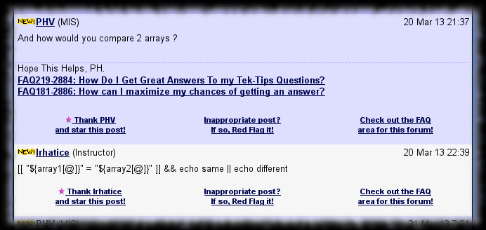
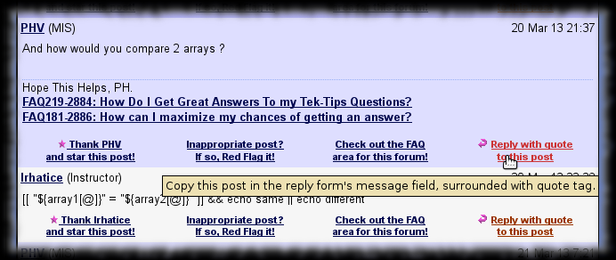

# TipMaster - Reply with Quote

Improves the [TipMaster](http://tipmaster.com/)'s forums, [Tek-Tips](http://tek-tips.com/) and [Eng-Tips](http://eng-tips.com/), by adding a link below each post on the
thread pages to copy the given post's content into the reply form's message field. The quote's parameter is the post's author's handle. The signature is not included.

The quoted message is converted back from HTML to TGML.

<del markdown="span">Protecting verbatim TGML as \[ignore\]\[valid TGML tag\]\[/ignore\] is not implemented yet. ( Actually there is an implementation, but is not
public as it is less optimal than could be, so I am looking for a better idea. )</del> ( I think it only works from a certain post date forward. If so, will not
fix it, but a better review is still pending. )

## Screenshot

sample rendering **without** TipMaster - Reply With Quote
{: .precaption .icon-screenshot}

sample rendering **with** TipMaster - Reply With Quote
{: .precaption .icon-screenshot}

## Usage

Click the "Reply with quote to this post" link below the message you want to reply to.

## Configuration

Configuration not really supported.

But you could add ( or remove ) some of the tag conversion rules declared in the `markup` array.

This script may clash with other Greasemonkey scripts, so you may have to adjust the execution order in your browser :

* [TipMaster - No Old New](tipmaster-no-old-new.html) jumps to the first unread post, so the post footer height adjustment made by this script makes the jump unprecise.
  Set this script to run _before_ TipMaster - No Old New.

## Versions

* 0.0 - February 2012
  * {: .added} Initial release.

* 0.1 - February 2012
  * {: .changed} Skip signature.

* 0.2 - March 2012
  * {: .fixed} Extracting the code tags' title now works.

* 0.3 - March 2012
  * {: .fixed} Consume pointless wbr tags.

* 0.4 - June 2012
  * {: .changed} Updated according to TipMaster sites' HTML changes.
  * {: .added} Recognizes the new \[box\], \[bbox\], \[floatl\], \[floatr\] and \[indent\] TGML tags.
  * {: .added} Handles \[ignore\] tag.
  * {: .fixed} Excludes signature.

* 0.5 - October 2012
  * {: .added} Recognizes the new \[pre\] TGML tag.
{: .changelog}

## Plans

* {: .pending} Make difference between \[spoiler\] and \[hide\] tags.
* {: .pending} Provide a way to convert to lighter markup, like \*bold\* instead of \[b\]bold\[/b\].
{: .todo}

## Download


