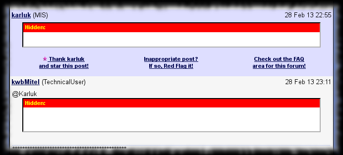
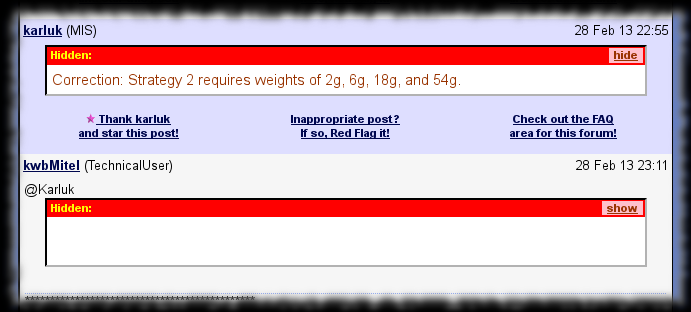

# TipMaster - Show/Hide Spoiler

Improves the [TipMaster](http://tipmaster.com/)'s forums, [Tek-Tips](http://tek-tips.com/) and [Eng-Tips](http://eng-tips.com/), by adding a link to each Spoiler and
Hidden block to toggle its content's visibility.

Personally I find the current method of selecting the text to make it visible uncomfortable.

## Screenshot

sample rendering **without** TipMaster - Show/Hide Spoiler
{: .precaption .icon-screenshot}

sample rendering **with** TipMaster - Show/Hide Spoiler
{: .precaption .icon-screenshot}

## Usage

You can click the link on the Spoiler or Hidden block's title bar to toggle the visibility of the given block' content.

## Configuration

Configuration not really supported.

But you could improve the CSS used to highlight.

## Versions

* 0.0 - March 2012
  * {: .added} Initial release.
{: .changelog}

## Plans

* {: .pending} Add link to toggle all spoiler's visibility.
{: .todo}

## Download


