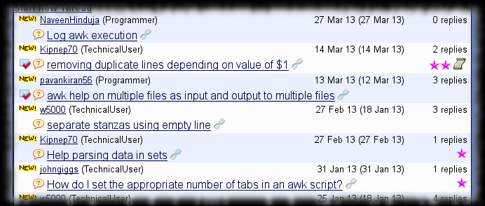
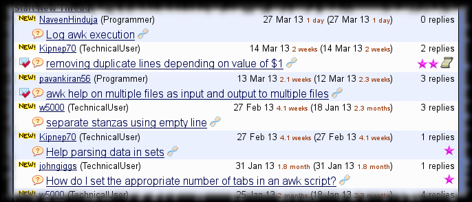

# TipMaster - Time Ago

Improves the [TipMaster](http://tipmaster.com/)'s forums, [Tek-Tips](http://tek-tips.com/) and [Eng-Tips](http://eng-tips.com/), by adding a relative fuzzy explanation
after dates on the following pages :

* Thread list
* Thread
* FAQ list
* MVP list
* Search result
* Started thread list
* Replied to thread list

The script does its best to correctly calculate the time. On the thread pages both date and time are specified, but on the other pages only the date. When time is known,
the script calculates with the precision of minutes otherwise with days.

On the thread pages the current server time specified in tooltips is used, otherwise is calculated knowing that TipMaster servers are located at GMT-5. An alternative
would be to use `document.lastModified` to avoid calculations exposed to errors due to unsynchronized daylight saving times around the world. `document.lastModified`
will certainly contain wrong data when the pages are reused from the browser cache, but as far as I observed, that happens only when the browser restores the previous
session.

## Screenshot

sample rendering **without** TipMaster - Time Ago
{: .precaption .icon-screenshot}

sample rendering **with** TipMaster - Time Ago
{: .precaption .icon-screenshot}

## Usage

None. There is nothing interactive.

## Configuration

Configuration not really supported.

But you could add ( or remove ) some of the time amounts declared in the `unit` array.

This script may clash with other Greasemonkey scripts, so you may have to adjust the execution order in your browser :

* [TipMaster - No Old New](tipmaster-no-old-new.html) parses the post time, so the relative time added by this script inside the same element will make the parsing fail.
  Set this script to run _after_ TipMaster - No Old New.

## Versions

* 0.0 - February 2012
  * {: .added} Initial release.
{: .changelog}

## Plans

* {: .pending} If other pages with dates are found, make the script to work on those too.
* {: .pending} Maybe add an exact alternative of the original date in a tooltip.
{: .todo}

## Download


