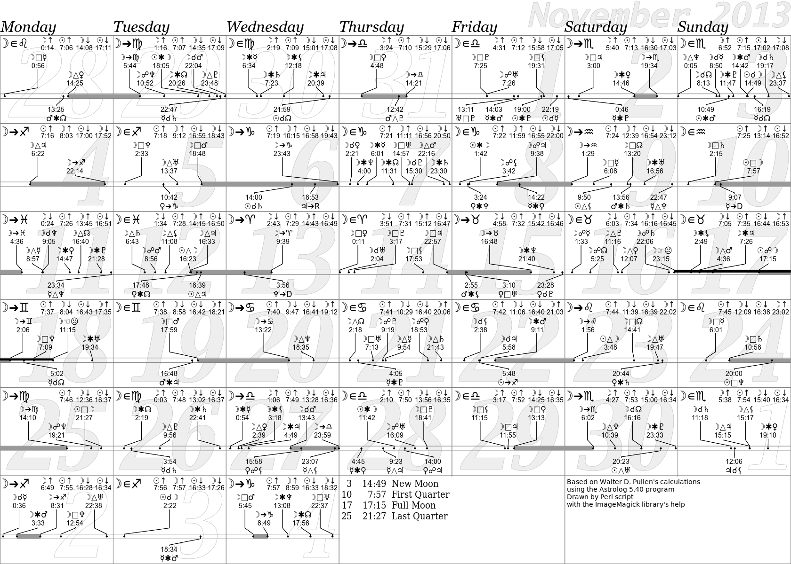

# AstroCal

In an astrology course the instructor used to sell astrological calendars each
year. Then suddenly quit. This script was written to fulfill the former pupils
requests for the astrological calendars.

Note  
This script does **not** perform astrological calculations. It uses Walter D.
Pullen's [Astrolog](http://www.astrolog.org/astrolog.htm).
{: .note .icon-info}

calendar for November 2013
{: .precaption .icon-image}

[{: .thumbnail}](cal-2013-11.png)

[{: .thumbnail}](astrocal-fontsample.png)

This was originally written in PHP. Then partially rewritten in Ruby.
( Cancelled due to a bug in the RMagic module. ) So this is the third rewrite.
This may explain some clumsiness, where the code was not refactored enough to be
more Perlish.

## Usage

sample output - `astrocal.pl --help`
{: .precaption .icon-screen}


Usage:
    astrocal.pl [-c *file*] [-l *lang*] [*date*]

Options:
    -c *file*
    --config=*file*
        Configuration file to load. It is an .ini file, its default name is
        astrocal.ini. ( See "astrocal.ini" below. )

    -l *file*
    --language=*file*
        Language file to load. It is an .ini file, its default name is
        astrocal-lang-{LANG}.ini. ( See "astrocal-lang.ini" below. )

    *date*
        Actually just the month part of the date for which to generate the
        calendar. Can be either in *year*-*month* or *month*-*year* order,
        separated by -, /, :, . or space. The *year* is optional and
        defaults to current year. The *year* must be specified on 4 digits,
        the *month* can have 1 or 2 digits. If *date* is not specified, the
        current month is used.


That means, the calendar in the above image was generated using :

sample output - `astrocal.pl`
{: .precaption .icon-screen}


AstroCal   version 0.0   january 2012   written by Feherke
graphical astrological calendar generator
loading configuration... Ok ( ./astrocal.ini )
processing configuration [........] Ok
loading language... skipped ( not specified )
processing language [..] Ok
loading daytime saving... Ok ( astrocal-shift.txt )
generating data [------] Ok
loading data [......] Ok
processing data... Ok
drawing...
Ok
writing image... Ok ( cal-2013-11.png )


## Configuration

The file names below are just the default names. You can use other names if you
prefer. So you can have multiple configuration files then each time specify the
one you need.

All these files are configuring only AstroCal. You will need another
configuration file for Astrolog, as documented by that program.

### astrocal.ini
{: .icon-file-config}

Main configuration file containing the essential configuration options. Its
syntax is mostly traditional .ini, but some of the entries have specially
formatted values, enumerating multiple properties.

The file has enough comments to guide the user through the configuration.

To help you deciding what king of font to use, there is a tool provided, called
AstroCal FontSample. It generates a huge image with sample text in all fonts
found on the system.

### astrocal-shift.txt
{: .icon-file-text}

The daylight saving shift intervals. Just a text file with date & time pairs.

In case you are lucky to live in an area where no daylight saving shifts are
performed, leave this file empty.

### astrocal-lang-en.ini
{: .icon-file-config}

Language file with the translatable texts of the generated images. ( Nope, the
script itself is not translatable. It has very few messages anyway. )

Well, the "en" one is actually pointless. English texts are built in. Use this
file as sample to translate AstroCal's texts into another language.

## Versions

* 0.0 - January 2012
  * {: .added} Initial release.
{: .changelog}

## Plans

* {: .pending} Make the date cells' layout configurable.
* {: .pending} Implement full color support, so parts of the texts can be
  colored differenty.
{: .todo}

## Download


