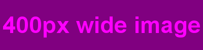

# Sketch

Not an outstanding name. Not an outstanding idea. There are already enough similar softwares and online services on the web. I wrote a couple of similar things myself too. Including in Python. The only new element was involving Django.

To make them available in multiple circumstances, I tried to make them as flexible as possible. So the placeholders can be generated through views, template filters and template tags. Of course, there are small differences between those
calling methods, but those are mostly imposed by the circumstances.

## Usage

### Image placeholder

The image placeholder is just an image of a certain size.
Inspired by free online services like [Cambelt](http://cambelt.co/), [Dynamic Dummy Image Generator](http://dummyimage.com/), [Fake images please?](http://fakeimg.pl/), [FPOImg ( "For Placement Only" )](http://fpoimg.com/),
[Ipsum Image](http://ipsumimage.appspot.com/), [Lorem Pixel](http://lorempixel.com/), [Placehold it](http://placehold.it/), [Yet Another Placeholder Generator](http://ima.gs/) ( in alphabetical order, no personal preference involved ).

image placeholder
{: .precaption .icon-file-image}

Live [image placeholder](http://feherke.pythonanywhere.com/sketch/image-demo/) demo, thanks to [PythonAnywhere](http://pythonanywhere.com/).
{: .icon-see}

It has few parameters :

| Parameter | Description              | Type                     | Default                |
|-----------|--------------------------|--------------------------|------------------------|
| `width`   | Image width              | Integer                  | 640                    |
| `height`  | Image height             | Integer                  | 480                    |
| `front`   | Text color               | Name or hexadecimal code | #666                   |
| `back`    | Background color         | Name or hexadecimal code | #999                   |
| `text`    | Inscription on the image | Text with placeholders   | %(width)s x %(height)s |

General notes :

* All parameters are optional.
* Parameters can appear in any order.
* The placeholders are string formatting conversion specifiers `%(...)s` and the mapping keys are the parameter names.

#### URL with verbose parameters

Suitable to be used from outside the Django application, typically in static HTML documents.

    /sketch/iph.png?width=400&height=100&front=fuchsia&back=purple&text=%25(width)px%20wide%20image

Additional notes :

* If the `front` and `back` parameter contains hexadecimal color code, "#" must be written URL encoded as %23.
* If the `text` parameter contains placeholder, "%" must be written URL encoded as %25.
* If the `text` parameter contains space, it must be written URL encoded as %20.

#### Friendly URL

    /sketch/iph/400/100/fuchsia/purple/%25(width)px%20wide%20image

Additional notes :

* The parameters must occur exactly in this order : `width`, `height`, `front`, `back` and `text`.
* The parameters can miss only from the _end_ of path. So when a parameter is present, all the preceding parameters must also be present.

The notes from the above URL with verbose parameters section also applies.

#### Template filter

Suitable for the rare case when you have the HTML `img` tag's source code in a template variable.



{{ '' | imgplace }}
{{ '' | imgplace:"front=fuchsia back=purple" }}



Additional notes :

* The `src` parameter's value will be replaced with the path to the generated image in the /static/ directory.
* The `front` and `back` parameters will not be passed over to the HTML code.
* The `text` parameter will take value from the `alt` HTML attribute, if needed and possible.
* Parameters needed for the placeholder but not needed for the HTML source code can be passed as filter parameters.

#### Template tag



{% imgplace width=100 height=50 front="fuchsia" back="purple" text="%(width)px wide image" %}



Additional notes :

* Although template tag parameters are usually quoted as \"foo=bar\", for similarity with HTML syntax, quoting like foo=\"bar\" is also accepted.

### Text placeholder

The text placeholder is just a text of a certain length.
Inspired by free online services like [Dummy Text Generator](http://dummytextgenerator.com/), [Gangsta Lorem Ipsum dummy text generator](http://lorizzle.nl/), [Lorem Ipsum Generator](http://lorem-ipsum.perbang.dk/),
[Lorem Ipsum](http://lipsum.com/), [professional lorem ipsum generator for typographers](http://generator.lorem-ipsum.info/) ( in alphabetical order, no personal preference involved ).

text placeholder
{: .precaption .icon-file-text}

Em mefahu sigelesimit esin ube.  Er elire ovexas ese ipa fe eni elalo ir eteg ihi inehediyalofin.  Abapisulesi ton le aheben mositataho.  Ciraca ah ut pogoceyepi ipas.  Toh bewayobepe erivite moru sey im sasusunefetane adenirere ale epeyat.  Werile gana neras cehe ineban rer ege bahet etecac beret ne enoyic.  Eni itesu webe etebene neremexa.  At iretib obaretol dosiri yareseto.  Or bef onasut res pot.  Iden i oliy raleye rugomisu.

Live [text placeholder](http://feherke.pythonanywhere.com/sketch/text-demo/) demo, thanks to [PythonAnywhere](http://pythonanywhere.com/).
{: .icon-see}

It has few parameters :

| Parameter | Description                         | Type                              | Default           |
|-----------|-------------------------------------|-----------------------------------|-------------------|
| `entity`  | Units of text to generate           | text, paragraph, sentence or word | text              |
| `length`  | Subunit count in the generated text | Integer                           | Random or 5       |
| `sample`  | Sample text to analyze              | Text                              | The Zen of Python |

General notes :

* All parameters are optional.
* Parameters can appear in any order.
* The `length` parameters's default value is 5 only for `entity` text, otherwise is randomly chosen based on the analyzed text.
* The `sample` is not really a parameter. It is a sample text to be used later by the random generator. In most cases there is no way to provide it.

#### URL with verbose parameters

Suitable to be used from outside the Django application, typically in static HTML documents.

    /sketch/blah.txt?entity=paragraph&length=10

#### Friendly URL

    /sketch/blah/paragraph/10

Additional notes :

* The parameters must occur exactly in this order : `entity` and `length`.
* The parameters can miss only from the _end_ of path. So when a parameter is present, all the preceding parameters must also be present.

#### Template filter

Suitable for the `sample` to analyze is in a template variable.



{{ 'Hello World' | blahblah:"paragraph 10" }}



Additional notes :

* The parameters must occur exactly in this order : `entity` and `length`.
* The `entity` parameter is mandatory.

#### Template tag







#### Template block tag




Hello World




## Configuration

You have to add sketch to the `INSTALLED_APPS` in your Django project's settings :

your_django_project/settings.py
{: .precaption .icon-file-script}


INSTALLED_APPS = (
    'your_django_project.sketch',
)


You have to `include()` the sketch urls into your Django project's urls :

your_django_project/urls.py
{: .precaption .icon-file-script}


urlpatterns = patterns('',
    url(r'^sketch/', include('your_django_project.sketch.urls')),
)


And generally you have to replace all occurences of "your_django_project" with... well, the name of your Django project.

Proper configuration not really supported.

One thing you may have to configure is the font used for the image placeholder's text. You can set it by editing the `image_placeholder()` function's first line :

sketch/image_placeholder.py
{: .precaption .icon-file-script}


def image_placeholder(param):
    fontfile = '/usr/share/fonts/X11/TTF/arialbd.ttf'
    minsize = 5
    maxsize = 500


The next two lines are the lower and upper limits between which a suitable font size is checked. The largest font size which still fits the image size will be used. Just so you know it. Hopefully you will never need to change those limits.

## Versions

* 0.0 - January 2014
  * {: .added} Initial release.
{: .changelog}

## Plans

* {: .pending} Specify image file format using the extension of iph.png. ( First of all GIF and JPEG, then maybe others too. )
* {: .pending} Specify text data structure using the extension of blah.txt. ( First of all HTML, XML and JSON, then maybe others too. )
* {: .pending} Clarify the img HTML tag-based syntax for the imgplace tag. ( foo=bar, foo="bar", "foo=bar", "foo='bar'" - when is bar string literal and when template variable name. )
* {: .pending} Implement multi-line text for image placeholder. ( Maybe with alignment too : "<left aligned", ">right aligned", "centered". )
* {: .pending} Maybe when the src attribute is specified for imgplace filter and tag, create the placeholder in that given place. ( May not be a good idea. )
* {: .pending} Think about implementing border for image placeholder. ( Either just 1 pixel of front color, or something customizable. )
{: .todo}

## Download


